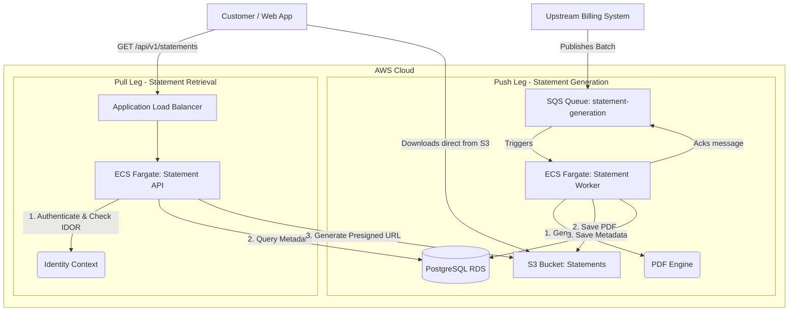

# Secure File Statement Delivery

## Project Overview
The Secure File Statement Delivery system is an enterprise-grade solution designed to securely generate, store, and deliver monthly bank statements to customers. It handles high-volume asynchronous statement generation (Push Leg) and provides secure, scalable, real-time access for customers retrieving their statements (Pull Leg).

This project was built adhering to AWS Well-Architected Framework principles, focusing on Security, Reliability, and Performance Efficiency, designed specifically to pass Capitec Bank's SE III technical assessment.

## Architecture Overview

The system is divided into two primary isolated flows to decouple write-heavy background processing from read-heavy customer traffic.



## Prerequisites
- Java 21 (LTS)
- Gradle 8.5+
- Podman (or Docker)
- Terraform 1.7+
- AWS CLI configured

## Quick Start (Local Development)

1. **Start dependencies using Podman**:
   ```bash
   podman-compose up -d
   ```
   *This starts LocalStack (SQS, S3) and PostgreSQL.*

2. **Run database migrations**:
   ```bash
   ./gradlew flywayMigrate
   ```

3. **Start the applications**:
   ```bash
   ./gradlew :api:bootRun
   ./gradlew :worker:bootRun
   ```

## API Documentation

### 1. List Statements
Retrieves metadata for all statements belonging to the authenticated customer.
**Endpoint:** `GET /api/v1/statements`
**Headers:** `Authorization: Bearer <JWT>`

**Response:**
```json
{
  "customerId": "CUST-123",
  "statements": [
    {
      "id": "stmt-8901",
      "statementDate": "2023-10-01",
      "sizeBytes": 145000,
      "status": "AVAILABLE"
    }
  ]
}
```

### 2. Download Statement
Generates a short-lived presigned URL for secure download directly from S3.
**Endpoint:** `GET /api/v1/statements/{id}/download`
**Headers:** `Authorization: Bearer <JWT>`

**Response:**
```json
{
  "downloadUrl": "https://s3.amazonaws.com/capitec-statements-prod/CUST-123/stmt-8901.pdf?X-Amz-Algorithm=AWS4-HMAC-SHA256&X-Amz-Credential=...&X-Amz-Expires=900&...",
  "expiresInSeconds": 900
}
```

## Testing Guide

The project enforces a strict 85% JaCoCo line coverage requirement.
- **Unit Tests:** Run with `./gradlew test`
- **Integration Tests:** Run with `./gradlew integrationTest` (uses Testcontainers)
- **Coverage Report:** Generated at `build/reports/jacoco/test/html/index.html`

## cURL Examples

**List Statements:**
```bash
curl -X GET http://localhost:8080/api/v1/statements \
  -H "Authorization: Bearer test-token-cust-123"
```

**Download Statement (Success):**
```bash
curl -X GET http://localhost:8080/api/v1/statements/stmt-8901/download \
  -H "Authorization: Bearer test-token-cust-123"
```

**IDOR Blocked (Attempting to access someone else's statement):**
```bash
curl -X GET http://localhost:8080/api/v1/statements/stmt-9999/download \
  -H "Authorization: Bearer test-token-cust-123"
# Response: 403 Forbidden (Audit log generated)
```

**Push a Test Message via SQS (LocalStack):**
```bash
aws --endpoint-url=http://localhost:4566 sqs send-message \
  --queue-url http://sqs.us-east-1.localhost.localstack.cloud:4566/000000000000/statement-generation \
  --message-body '{"customerId": "CUST-123", "period": "2023-10"}'
```

## Infrastructure & CI/CD
Deployment is managed via **Terraform** (`/terraform` directory) with separate state files for staging and production.
CI/CD is handled via GitHub Actions, performing:
1. Compile & Unit Test
2. Integration Test (Testcontainers)
3. SonarQube Analysis
4. Build OCI Image (Jib)
5. Push to ECR
6. Terraform Apply / ECS Deploy

## Technology Decisions Summary

| Component | Technology | Rationale |
| :--- | :--- | :--- |
| **Language** | Java 21 | Virtual threads for concurrent API requests, latest LTS. |
| **Framework** | Spring Boot 3.2 | Enterprise standard, Spring Cloud AWS integration. |
| **Compute** | ECS Fargate | Serverless container execution, predictable scaling. |
| **Database** | PostgreSQL | ACID compliance, strong relational integrity for metadata. |
| **Storage** | AWS S3 | Infinite scale, lifecycle policies, presigned URLs. |
| **Messaging** | SQS | Reliable DLQ handling, high throughput, at-least-once delivery. |
| **IaC** | Terraform | Cloud-agnostic syntax, robust state management. |
